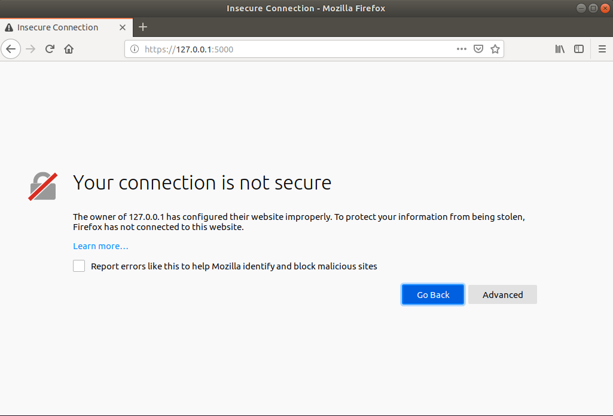
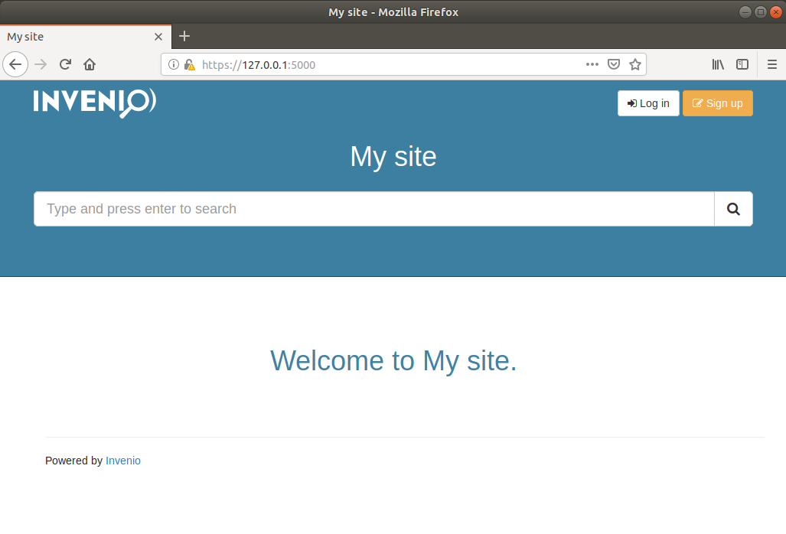

# Tutorial 01 - Getting started

The goal of this tutorial is to scaffold, install and run your first Invenio
instance. This step is identical to the [Quickstart](https://invenio.readthedocs.io/en/latest/quickstart/quickstart.html)

## Step 1: Prerequisites

First ensure you have prepared your environment according to
[the guide](../00-prerequisites/).

## Step 2: Checkout source code

First, open a terminal and checkout the tutorials source code:

```bash
$ cd ~/src
$ git clone https://github.com/inveniosoftware/training.git
```

**Tip:** To copy/paste into the terminal inside the Ubuntu virtual machine
use: Ctrl+Shift+P (paste), Ctrl+Shift+C (copy), Ctrl+Shift+X (cut).

## Step 3: Scaffold

Scaffold the skeleton for your first Invenio instance:

```bash
$ cookiecutter gh:inveniosoftware/cookiecutter-invenio-instance -c v3.1 --no-input
```

## Step 4: Install

Start the database, Elasticsearch, RabbitMQ and Redis cache using Docker:

```bash
$ cd my-site
$ docker-compose up -d
```

Install and build the Python and NPM dependencies:

```bash
$ ./scripts/bootstrap
```

## Step 5: Run

Setup the database tables, search indexes, queues and caches:

```bash
$ ./scripts/setup
```

Start a development server and background job worker:

```bash
$ ./scripts/server
```

Last, open https://127.0.0.1:5000/ in your browser:

```bash
$ firefox https://127.0.0.1:5000/
```

Firefox and other browsers will display a security warning because we are trying
to open a secure connection to a server with a self-signed certificate:



Simply by pass this warning, by clicking "Advanced" and confirm the certificate
as an execption. Afterwards, you should now see your first Invenio instance
running:


