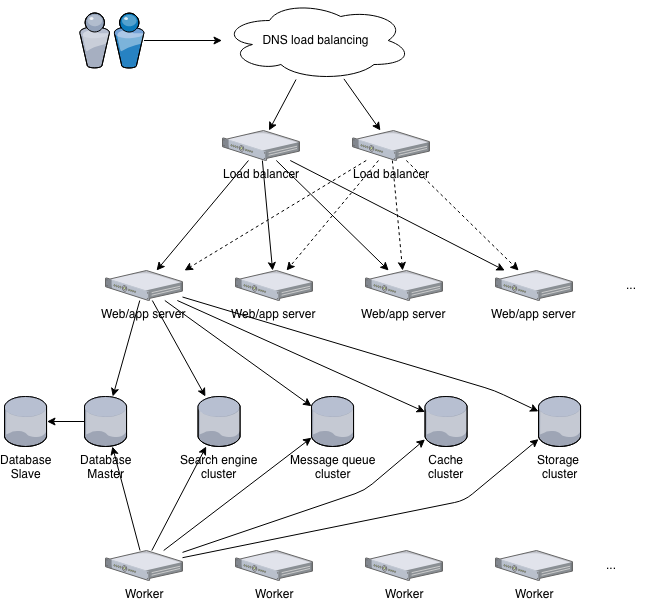
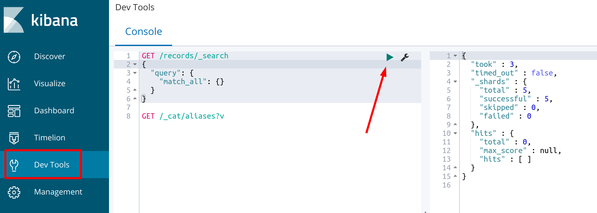
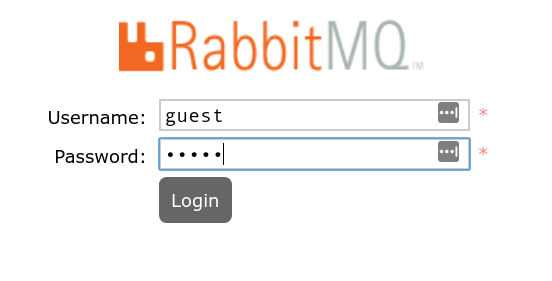
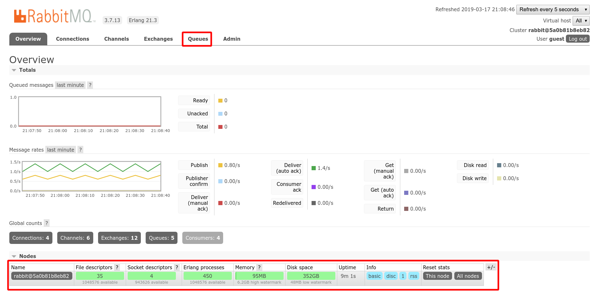
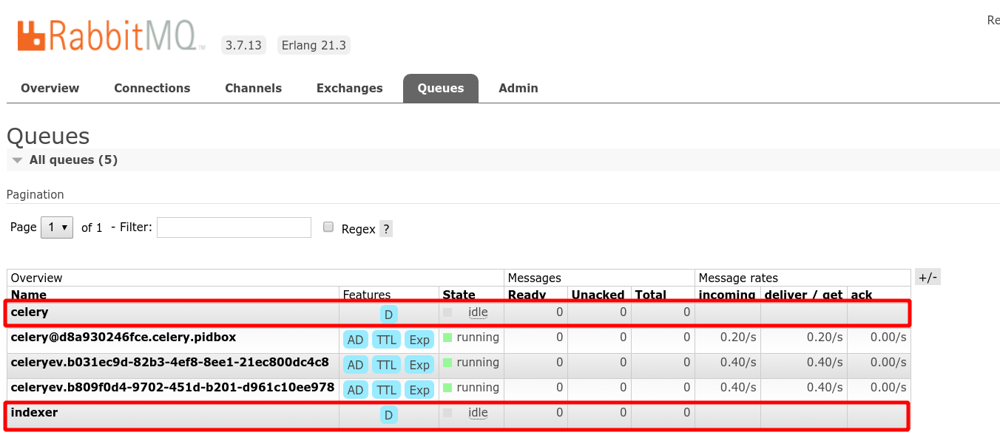
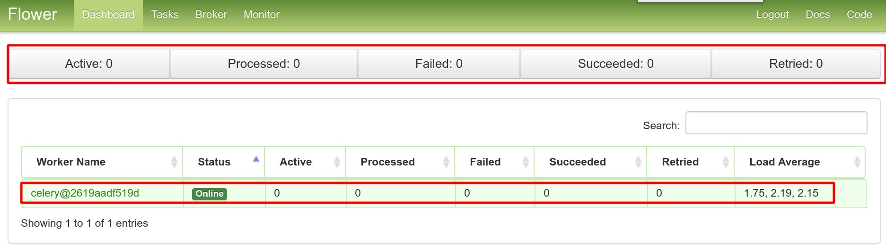
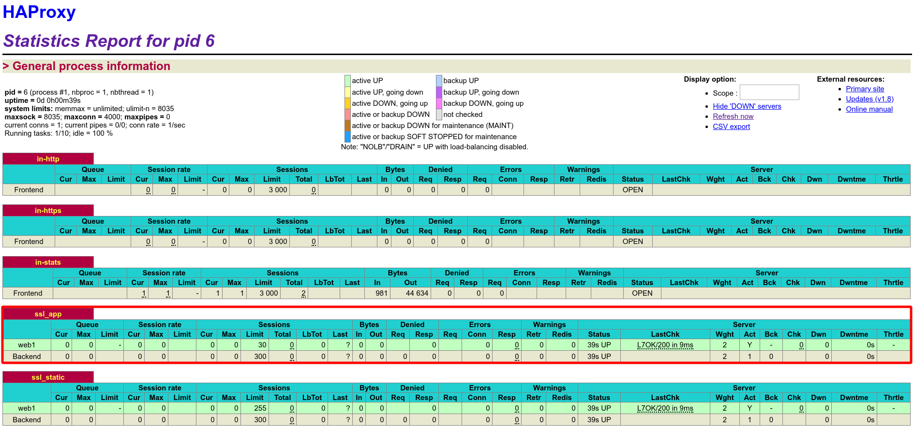
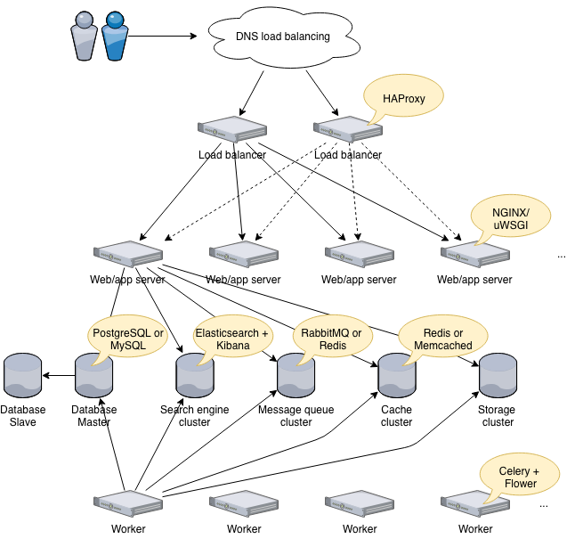

# Tutorial 03 - Infrastructure overview

In this session, we will explore the underlying infrastructure of an Invenio
repository. We will see the database, search engine, cache, message queue, load
balancer, web server, application server and application background workers. We
will explore tools to interact with the services and we will see monitoring and
debugging interfaces like Flower, Kibana and the RabbitMQ management interface.

### Table of Contents

- [Step 1: Bring up the full docker-compose setup](#step-1-bring-up-the-full-docker-compose-setup)
- [Step 2: Access the database (PostgreSQL)](#step-2-access-the-database-postgresql)
- [Step 3: Access the cache (Redis)](#step-3-access-the-cache-redis)
- [Step 4: Access Elasticsearch (and Kibana)](#step-4-access-elasticsearch-and-kibana)
- [Step 5: Access the message queue (RabbitMQ)](#step-5-access-the-message-queue-rabbitmq)
- [Step 6: Monitor background workers (Flower)](#step-6-monitor-background-workers-flower)
- [Step 7: Access the web application(s) (uWSGI)](#step-7-access-the-web-applications-uwsgi)
- [Step 8: Access the load balancer (HAProxy)](#step-8-access-the-load-balancer-haproxy)
- [What did we learn](#what-did-we-learn)

## Step 1: Bring up the full docker-compose setup

In order to be able to go through all of the infrastructure components that an
Invenio instance is built from, we have to use the `docker-compose.full.yml`
setup. It is used for demonstration purposes, since it allows us to run all
components in containers. To bring it up we have to execute the following
commands:

```bash
# Build our Invenio application images first
$ ./docker/build-images.sh
$ docker-compose -f docker-compose.full.yml up -d
```

To make sure our instance is running properly, open <https://localhost>

Here's a full diagram of what the `docker-compose.full.yml` infrastructure
looks like:



## Step 2: Access the database (PostgreSQL)

To access the PostgreSQL database container we will first have to open a Bash
shell inside the container by running the following:

```bash
$ docker-compose -f docker-compose.full.yml exec db bash
root@fe08ce46945e:/#
```

Now that we have a shell inside the container we can access the PostgreSQL
instance via using the `psql` CLI tool in order to run SQL queries and other
commands:

```bash
root@fe08ce46945e:/# psql -h localhost -U my-site my-site
psql (9.6.12)
Type "help" for help.

my-site=# -- Let's see what tables, users we have
my-site=# \dt
                     List of relations
 Schema |              Name              | Type  |  Owner
--------+--------------------------------+-------+---------
 public | access_actionsroles            | table | my-site
 public | access_actionssystemroles      | table | my-site
 public | access_actionsusers            | table | my-site
 public | accounts_role                  | table | my-site
 public | accounts_user                  | table | my-site
 public | accounts_user_session_activity | table | my-site
 public | accounts_userrole              | table | my-site
 public | alembic_version                | table | my-site
 public | oaiserver_set                  | table | my-site
 public | oauth2server_client            | table | my-site
 public | oauth2server_token             | table | my-site
 public | oauthclient_remoteaccount      | table | my-site
 public | oauthclient_remotetoken        | table | my-site
 public | oauthclient_useridentity       | table | my-site
 public | pidstore_pid                   | table | my-site
 public | pidstore_recid                 | table | my-site
 public | pidstore_redirect              | table | my-site
 public | records_metadata               | table | my-site
 public | records_metadata_version       | table | my-site
 public | transaction                    | table | my-site
 public | userprofiles_userprofile       | table | my-site
(21 rows)

my-site=# -- Let's query the Users table
my-site=# select * from accounts_user;
```

## Step 3: Access the cache (Redis)

In a similar fashion we can access the `cache` container (running Redis), and
use the `redis-cli` tool:

```bash
$ docker-compose -f docker-compose.full.yml exec cache bash
root@cecefcf8bb2c:/data# redis-cli
127.0.0.1:6379> info server
# Server
redis_version:5.0.3
redis_git_sha1:00000000
redis_git_dirty:0
redis_build_id:5a396a3a77241301
redis_mode:standalone
os:Linux 4.15.0-46-generic x86_64
arch_bits:64
multiplexing_api:epoll
atomicvar_api:atomic-builtin
gcc_version:6.3.0
process_id:1
run_id:4c81e496de94b2f7dcc2ed849bc396dec211e8b9
tcp_port:6379
uptime_in_seconds:75
uptime_in_days:0
hz:10
configured_hz:10
lru_clock:9360847
executable:/data/redis-server
config_file:
```

## Step 4: Access Elasticsearch (and Kibana)

To access the Elasticsearch service, we can just use `curl` to make requests to
the HTTP API exposed at <http://localhost:9200>:

```bash
$ curl localhost:9200
{
  "name" : "D0umeI7",
  "cluster_name" : "docker-cluster",
  "cluster_uuid" : "78iDs5LMQDS2G2uBySKTaw",
  "version" : {
    "number" : "6.6.0",
    "build_flavor" : "oss",
    "build_type" : "tar",
    "build_hash" : "a9861f4",
    "build_date" : "2019-01-24T11:27:09.439740Z",
    "build_snapshot" : false,
    "lucene_version" : "7.6.0",
    "minimum_wire_compatibility_version" : "5.6.0",
    "minimum_index_compatibility_version" : "5.0.0"
  },
  "tagline" : "You Know, for Search"
}

$ curl "localhost:9200/_cat/indices?v"
health status index                 uuid                   pri rep docs.count docs.deleted store.size pri.store.size
yellow open   records-record-v1.0.0 RnUbgClCSVibaiws6jFYfQ   5   1          0            0      1.1kb          1.1kb
green  open   .kibana_1             UKkc1n2lS5a-zZu6izIJIg   1   0          0            0       230b           230b
```

We can also access the instance via the Kibana service container at
<http://localhost:5601>:



## Step 5: Access the message queue (RabbitMQ)

To access the RabbitMQ service, we can use Management Web UI at
<http://localhost:15672>. The default username/password is `guest`/`guest`:





An interesting view in the RabbitMQ Management UI is the Queues tab, where you
can inspect the number of messages and throughput of important queues used by
Invenio:



## Step 6: Monitor background workers (Flower)

The Invenio instance is making use of Celery workers to run asynchornous
background tasks. You can monitor these workers by accessing the Flower
monitoging UI at <http://localhost:5555>:



## Step 7: Access the web application(s) (uWSGI)

The Invenio web application is running via the `uWSGI` server, and is split
into two containers, `web-ui` (exposing the UI views at `/`), and `web-api`
(exposing the REST API at `/api`). Let's access the `web-ui` container:

```bash
$ docker-compose -f docker-compose.full.yml exec web-ui bash
[root@1d5f2e316bdc src]#
```

There are two insteresting commands for these type of containers:

- `uwsgitop`, for getting a `top`-like overview of the uWSGI web workers
- `uwsgi_curl`, for making `curl` like requests using the uWSGI protocol

```bash
[root@1d5f2e316bdc src]# uwsgitop localhost:9000
uwsgi-2.0.18 - Sun Mar 16 13:20:27 2019 - req: 0 - RPS: 0 - lq: 0 - tx: 0
node: localhost - cwd: /opt/invenio/src - uid: 1000 - gid: 1000 - masterpid: 7064
 WID    %       PID     REQ     RPS     EXC     SIG     STATUS  AVG     RSS     VSZ     TX      ReSpwn  HC      RunT    LastSpwn
 1      0.0     7877    0       0       0       0       idle    0ms     0       0       0       1       0       0.0     13:19:57
 2      0.0     7879    0       0       0       0       idle    0ms     0       0       0       1       0       0.0     13:19:57

[root@1d5f2e316bdc src]# uwsgi_curl 127.0.0.1:5000 /ping
HTTP/1.1 200 OK
Content-Type: text/html; charset=utf-8
Content-Length: 2
X-Frame-Options: sameorigin
X-XSS-Protection: 1; mode=block
X-Content-Type-Options: nosniff
Content-Security-Policy: default-src 'self'; object-src 'none'
X-Content-Security-Policy: default-src 'self'; object-src 'none'
Referrer-Policy: strict-origin-when-cross-origin
X-RateLimit-Limit: 5000
X-RateLimit-Remaining: 4999
X-RateLimit-Reset: 1552865553
Retry-After: 3600
Set-Cookie: session=f22ff41b827e61a4_5c8ecb00.hkULtydCgh-swx8QmHLzhuu-hIo; 
            Expires=Wed, 17-Apr-2019 22:32:32 GMT; Secure; HttpOnly; Path=/
X-Session-ID: f22ff41b827e61a4_5c8ecb00

OK
```

## Step 8: Access the load balancer (HAProxy)

The load balancer, being at the edge of our infrastructure, besides serving
the web application at <https://localhost>, is also exposing a statistics
panel at <http://localhost:8080>:



## What did we learn



- The different services composing an Invenio instance
- How to interface with them on a basic level
