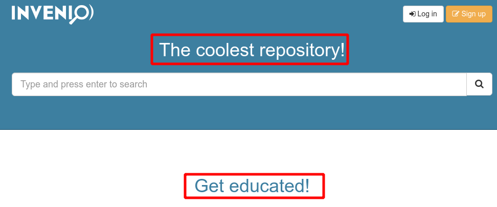
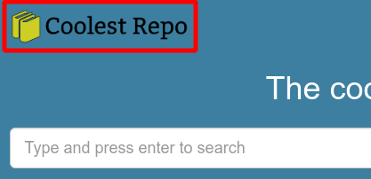
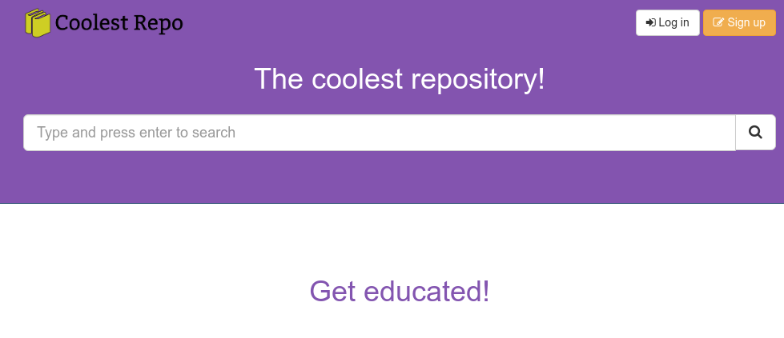
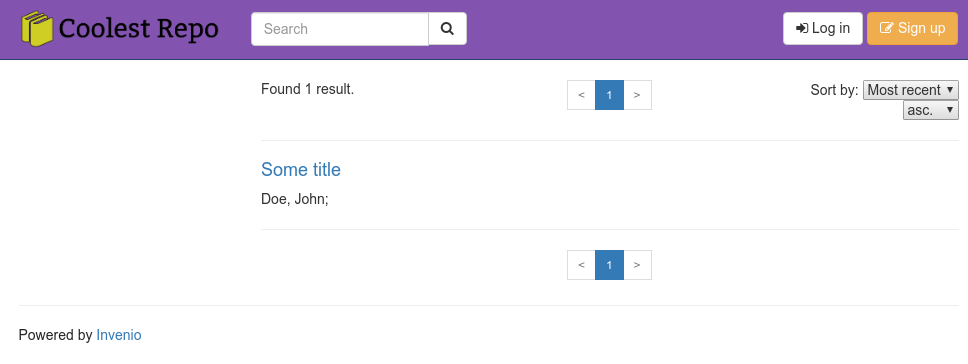
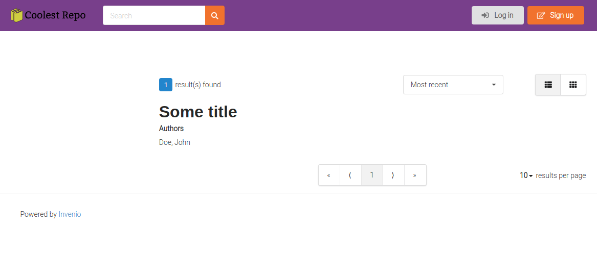
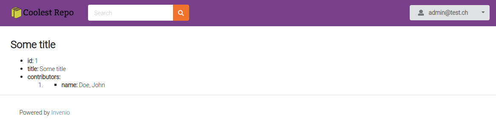
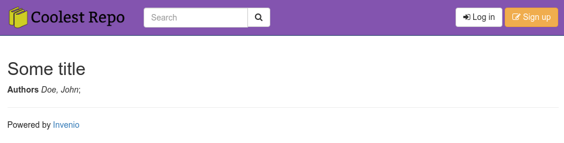

# Tutorial 05 - Customizing the look & feel

In this session we will customize minor visual elements of our Invenio
instance, like the logo of our instance, the colors and fonts, the way search
results for records are displayed and the display page for every record.

### Table of Contents

- [Step 1: Run the development server](#step-1-run-the-development-server)
- [Step 2: Change the frontpage title](#step-2-change-the-frontpage-title)
- [Step 3: Change the site logo](#step-3-change-the-site-logo)
- [Step 4: Change the theme color](#step-4-change-the-theme-color)
- [Step 5: Change how record search results are displayed](#step-5-change-how-record-search-results-are-displayed)
- [Step 6: Change how the record page](#step-6-change-how-the-record-page)

## Step 1: Run the development server

If your development server is not running you can type:

```bash
$ cd ~/src/my-site
$ docker-compose up -d
$ ./scripts/server
```

## Step 2: Change the frontpage title

Although the default look of the instance looks fine, we can do better! Let's
start small by changing some text on the frontpage. To do so we have to edit
`my_site/config.py`:

```diff
# Theme configuration
# ===================
#: Site name
THEME_SITENAME = _('My site')
#: Use default frontpage.
THEME_FRONTPAGE = True
#: Frontpage title.
-THEME_FRONTPAGE_TITLE = _('My site')
+THEME_FRONTPAGE_TITLE = _('The coolest repository!')
#: Frontpage template.
THEME_FRONTPAGE_TEMPLATE = 'my_site/frontpage.html'
```

If you now go to <https://localhost:5000/> you will see the changed title:



## Step 3: Change the site logo

Our instance is powered by Invenio, but not defined by it! Let's change the
logo to something else. First we have to add the actual image of our new logo
inside a folder that our application will know it's part of its assets:

```bash
# Create the "static/images" folder inside the "my_site/theme" directory
$ mkdir -p my_site/theme/static/images
# Copy the provided logo from
$ cp ~/src/training/05-customizing-invenio/extras/my-site-logo.png my_site/theme/static/images/
# We have to tell the application to "collect" the new static file
$ invenio collect -v
Collect static from blueprints.
Copied: [my_site] '/home/bootcamp/.local/share/virtualenvs/my-site-7Oi5HgLM/var/instance/static/images/my-site-logo.png'
```

We also have to override the `THEME_LOGO` configuration variable, by adding it
in `my_site/config.py`:

```diff
# Theme configuration
# ===================
#: Site name
THEME_SITENAME = _('My site')
#: Use default frontpage.
THEME_FRONTPAGE = True
#: Frontpage title.
THEME_FRONTPAGE_TITLE = _('The coolest repository!')
#: Frontpage template.
THEME_FRONTPAGE_TEMPLATE = 'my_site/frontpage.html'
+#: Theme logo.
+THEME_LOGO = 'images/my-site-logo.png'
```

If you reload the page you will see the new logo on the top left:



## Step 4: Change the theme color

Until this moment, we've basically performed "content" changes. In order to
modify the "style" of the site we have to make changes to the produced CSS.

Invenio uses SCSS in order define CSS styles in a flexible and extensible way.
The `.scss` we are interested in changing is
`my_site/theme/assets/scss/variables.scss`:

```diff
@import "../invenio_theme/variables";

// If you want to change the primary color you can do something like:
-// $color1: rgba(100, 42, 156, 0.8);
-// $color1-gradient: lighten($color1, 15%);
-// $navbar-default-bg: $color1;
+$color1: rgba(100, 42, 156, 0.8);
+$color1-gradient: lighten($color1, 15%);
+$navbar-default-bg: $color1;
```

After changing the file, we have to rebuild our assets using the `invenio
webpack` command:

```bash
(my-site) $ invenio webpack buildall
...webpack
```

If we reload our page now we should see our brand new design:



## Step 5: Change how record search results are displayed

If you navigate to the search results page (<https://localhost:5000/search>)
you can see the following:



Let's change the way the title and authors of each result look like. The
current search UI application is built with AngularJS and its various
components are defined via Angular HTML templates. In our case we'll have to
modify the `my_site/records/static/templates/records/results.html`:

```diff
<div ng-repeat="record in vm.invenioSearchResults.hits.hits track by $index">
- <h4><a target="_self" ng-href="/records/{{ record.id }}">{{ record.metadata.title }}</a></h4>
+ <h3><a target="_self" ng-href="/records/{{ record.id }}">{{ record.metadata.title }}</a></h3>
+ <strong>Authors</strong>
  <ul class="list-inline">
      <li ng-repeat='contributor in record.metadata.contributors'>
-       {{ contributor.name }};
+       <em>{{ contributor.name }}</em>;
      </li>
  </ul>
  <hr />
</div>
```

Again, we'll have to run the `invenio collect` command, since we changes static
files:

```bash
(my-site) $ invenio collect -v
Collect static from blueprints.
Copied: [my_site_records] '/home/bootcamp/.local/share/virtualenvs/my-site-7Oi5HgLM/var/instance/static/templates/records/results.html'
```

And now, if we refresh we'll see that our search results display differently:



## Step 6: Change how the record page

If you actually click on one of the search results you will be redirected to
the record's page:



To change this view we'll have to modify the Jinja template that renders the
page, `my_site/records/templates/records/record.html`. Let's to something
similar to what we did with the search results:

```diff

<div class="container">
  <h2>{{record.title}}</h2>
- <div class="panel panel-default">
-   <ul class="list-group">
-     {{ record_content(record) }}
-   </ul>
- </div>
+ <strong>Authors</strong>
+ 
+ <em>{{ author.name }}</em>;
+ 
</div>

```

If you refresh the record's page you'll see something like this:


