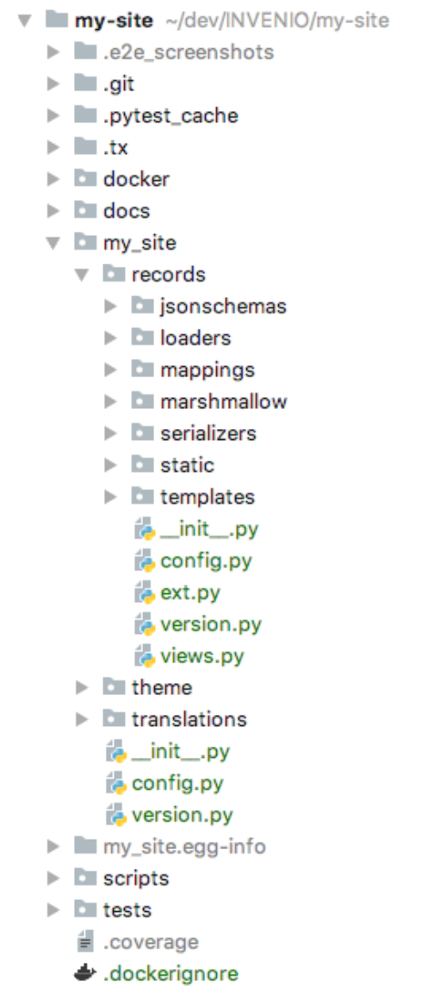
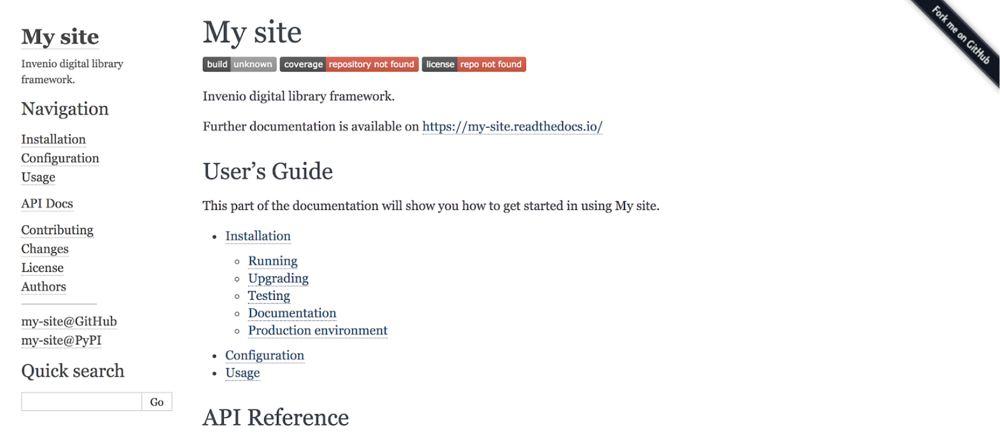
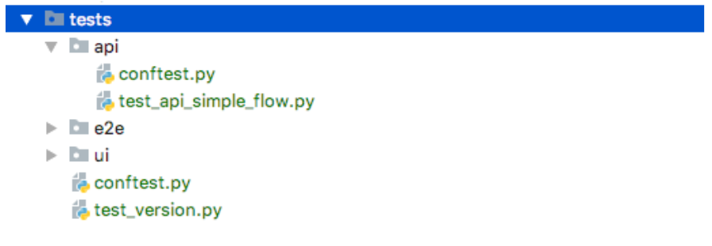
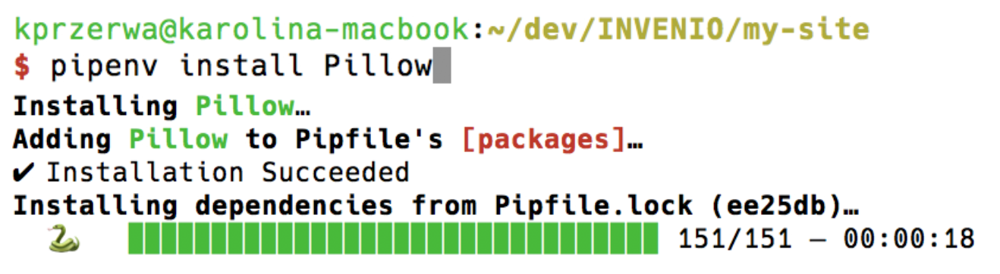

# Developing with Invenio

## Table of contents

- [Table of contents](#table-of-contents)
- [Step 1: Inspect Invenio project file structure](#step-1-inspect-invenio-project-file-structure)
- [Step 2: Initialize a git repository](#step-2-initialize-a-git-repository)
- [Step 3: Build the documentation](#step-3-build-the-documentation)
- [Step 4: Running tests](#step-4-running-tests)
- [Step 5: End-to-end testing](#step-5-end-to-end-testing)
- [Step 6: Fix the failing test](#step-6-fix-the-failing-test)
- [Step 7: Installing a new Python dependency](#step-7-installing-a-new-python-dependency)
- [Extra: Useful development commands](#extra-useful-development-commands)
  - [Scripts](#scripts)
  - [Pipenv](#pipenv)
  - [Docker troubleshooting](#docker-troubleshooting)
- [What did we learn](#what-did-we-learn)

## Step 1: Inspect Invenio project file structure

Open the project directory and scan the files



## Step 2: Initialize a git repository

Initialize git repository

```bash
git init
```

Stage your changes for commit

```bash
git add --all
```

Update manifest file

```bash
check-manifest --update
```

## Step 3: Build the documentation

The documentation has already written basic information for you. However you can expand it by adding your own pages and by writing docstrings, which are very helpful in the later development process. To build the documentation simply run the command below inside your virtualenv. The documentation has to be built any time when there are changes in the pages or docstrings.

Build documentation:

```bash
(my-site)$ python setup.py build_sphinx
```

Now you can open `docs/_build/html/index.html` (so when using the VM: `file:///home/bootcamp/src/my-site/docs/_build/html/index.html`) in the browser to see the documentation:



## Step 4: Running tests

Invenio provides examples of tests in the project's repository:



Before you run tests you need all the development docker services to be up and running:

Run docker services

```bash
docker-compose up
```

To run the tests you can use the test script provided in the repository (the script runs automatically inside virtualenv):

```bash
./run-tests.sh
```

> If you get an error `Your API Key '...' is invalid` type in a terminal `export PIPENV_PYUP_API_KEY=""`

To run the test functions one by one you should activate the virtualenv of your project and use pytest command, like on the example below:

```bash
(my-site)$ pytest tests/api/test_api_record_files.py::test_record_creation
```

> If you get an error `IndexAlreadyExistsError: index/alias with name ... already exists` you have to destroy the development indexes for tests. `invenio index destroy` which takes the optional params `--force` and `--yes-i-know` to skip any confirmation steps.

## Step 5: End-to-end testing

To enable end-to-end testing you have to set up your environment variables, as well as install proper browser drivers (e2e testing opens up a browser to test UI).

1. Download and install latest driver for your environment (is required to open a browser for UI tests):
    - [Windows / MacOs](https://github.com/mozilla/geckodriver/releases)
    - [Bootcamp virtual machine](https://github.com/mozilla/geckodriver/releases/download/v0.24.0/geckodriver-v0.24.0-linux64.tar.gz)
2. Enable E2E testing

    ```bash
    export E2E="yes"
    ```

## Step 6: Fix the failing test

Open the file `tests/e2e/test_front_page.py` in your editor.
Edit the string in assert command to match the string in the changed `index.html` template.

Run tests again:

```bash
./run-tests.sh
```

## Step 7: Installing a new Python dependency

In order to test a new package, simply install it in the virtualenv using `pip` tool:

```bash
(my-site)$ pip install Pillow
```

This won't add the package to your project. It won't modify the Pipfile or Pipfile.lock.

If you decide not to add `Pillow` to your project, you can simply run:

```bash
pipenv sync --dev
```

which will restart your virtualenv to initial state, according to actual Pipfile.

On the other hand if you decide to include the `Pillow` package, run:

```bash
pipenv install Pillow
```



The Pipfile and Pipfile.lock will be modified. You should include both files in your repository:

```bash
git add Pipfile
git add Pipfile.lock
git commit -m "global: added Pillow package"
```

## Extra: Useful development commands

Set up environment variable for debug mode

```bash
export FLASK_DEBUG=1
```

### Scripts

Initialize database from scratch

```bash
./scripts/setup
```

Build project assets, (re)install dependencies

```bash
./scripts/bootstrap
```

Run invenio server (if `$FLASK_DEBUG=1` server refreshes on change of the code)

```bash
./scripts/server
```

### Pipenv

Installing python dependencies (updated as Pipfile indicates)

```bash
pipenv sync --dev
```

Activate virtualenv

```bash
pipenv shell
```

### Docker troubleshooting

To `stop` and `remove` all docker containers

```bash
docker stop $(docker ps -a -q)
docker rm $(docker ps -a -q)
```

## What did we learn

1. What Invenio project instance supplies
2. How to initialize and manage git repository
3. How to build a documentation
4. How to run docker services for development support
5. How to run tests
6. How to add python dependency to the project
7. What scripts to use in the development process
8. How to support Test Driven Development
