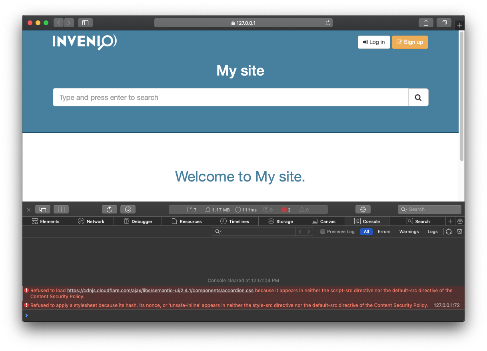
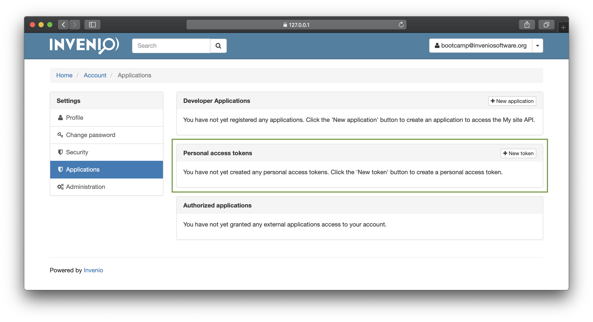

## Tutorial 13 - Securing your Invenio instance

In this session, you will discover the key points which will ensure that your Invenio instances are secure. You will learn how to protect the web application with configuration, package management and authentication.

Table of contents:
- [Bootstrap exercise](#bootstrap-exercise)
- [Configuration: allowed hosts](#configuration-allowed-hosts)
- [Configuration: secret key](#configuration-secret-key)
- [Configuration: SSL certificates](#configuration-ssl-certificates)
- [Configuration: WSGI proxies](#configuration-wsgi-proxies)
- [Invenio HTTP headers walk-through](#invenio-http-headers-walk-through)
- [Content-Security-Policy](#content-security-policy)
- [Keeping packages up to date](#keeping-packages-up-to-date)
- [Secure file uploads](#secure-file-uploads)
- [Auth workflows](#auth-workflows)
- [Migrating user tokens](#migrating-user-tokens)

## Bootstrap exercise

Start from a clean and working instance with some demo data:

```console
$ ./start-from.sh 12-managing-access
$ ./demo-data.sh # with an instance of ./scripts/server running
```

## Configuration: allowed hosts

You should update our `APP_ALLOWED_HOSTS` to the correct value in your production instances. If you try to make a request with different host header than this one you will be blocked.

```console
$ curl -ki -H "Host: evil.io" https://127.0.0.1:5000/api/records/
HTTP/1.0 400 BAD REQUEST
Content-Type: application/json
Content-Length: 56
X-Frame-Options: sameorigin
X-XSS-Protection: 1; mode=block
X-Content-Type-Options: nosniff
Content-Security-Policy: default-src 'self'; object-src 'none'
X-Content-Security-Policy: default-src 'self'; object-src 'none'
Strict-Transport-Security: max-age=31556926; includeSubDomains
Referrer-Policy: strict-origin-when-cross-origin
Server: Werkzeug/0.14.1 Python/3.6.7
Date: Wed, 13 Mar 2019 05:35:18 GMT

{"message":"Host \"evil.io\" is not trusted","status":400}
```

Lets say now that you allow now  any host in `my_site/config.py`:

```diff
 #: provided, the allowed hosts variable is set to localhost. In production it
 #: should be set to the correct host and it is strongly recommended to only
 #: route correct hosts to the application.
-APP_ALLOWED_HOSTS = ['my-site.com', 'localhost', '127.0.0.1']
+APP_ALLOWED_HOSTS = None

 # OAI-PMH
 # =======
```

Now potential attackers could inject a host header and make all your self links point to their evil site:

```console
$ curl -kI -H 'Host: evil.io' https://127.0.0.1:5000/api/records
HTTP/1.0 301 MOVED PERMANENTLY
Content-Type: text/html; charset=utf-8
Content-Length: 263
Location: https://evil.io/api/records/
X-Frame-Options: sameorigin
X-XSS-Protection: 1; mode=block
X-Content-Type-Options: nosniff
Content-Security-Policy: default-src 'self'; object-src 'none'
X-Content-Security-Policy: default-src 'self'; object-src 'none'
Strict-Transport-Security: max-age=31556926; includeSubDomains
Referrer-Policy: strict-origin-when-cross-origin
Server: Werkzeug/0.14.1 Python/3.6.7
Date: Sun, 17 Mar 2019 10:57:46 GMT
```

## Configuration: secret key

Change in `my_site/config.py` your `SECRET_KEY` and store it safely with only one user with read permissions:

```diff
 #: Secret key - each installation (dev, production, ...) needs a separate key.
 #: It should be changed before deploying.
-SECRET_KEY = 'CHANGE_ME'
+SECRET_KEY = '<strong-randomly-generated-key>'
 #: Max upload size for form data via application/mulitpart-formdata.
 MAX_CONTENT_LENGTH = 100 * 1024 * 1024  # 100 MiB
 #: Sets cookie with the secure flag by default
```

For example, we could use the Python 3 `secrets` library:
```console
$ export OLD_SECRET_KEY=CHANGE_ME
$ export NEW_SECRET_KEY=`python -c 'import secrets; print(secrets.token_hex(32))'`
$ sed -i "s/$OLD_SECRET_KEY/$NEW_SECRET_KEY/g" my_site/config.py
```

## Configuration: SSL certificates

Invenio works only with HTTPS so we create temporary certificates when starting new instances, **these certificates need to be updated**.

## Configuration: WSGI proxies

The `docker-compose.full.yml` represents the common way Invenio is deployed, with two reverse proxies in front of the application. If you have a different number of proxies in front you should update your `WSGI_PROXY`, for more information read [here](https://invenio-base.readthedocs.io/en/latest/api.html#invenio_base.wsgi.wsgi_proxyfix).

## Invenio HTTP headers walk-through

```console
$ curl -kI  https://127.0.0.1:5000/api/records/
HTTP/1.0 200 OK
Content-Type: application/json
Content-Length: 293
Link: <https://127.0.0.1:5000/api/records/?page=1&sort=mostrecent&size=10>; rel="self"
X-Frame-Options: sameorigin
X-XSS-Protection: 1; mode=block
X-Content-Type-Options: nosniff
Content-Security-Policy: default-src 'self'; object-src 'none'
X-Content-Security-Policy: default-src 'self'; object-src 'none'
Strict-Transport-Security: max-age=31556926; includeSubDomains
Referrer-Policy: strict-origin-when-cross-origin
X-RateLimit-Limit: 5000
X-RateLimit-Remaining: 4995
X-RateLimit-Reset: 1552654657
Retry-After: 3024
Server: Werkzeug/0.14.1 Python/3.6.7
Date: Fri, 15 Mar 2019 12:07:12 GMT
```

**Content-Type**: depending on the type user agents will perform default actions on the served content. For example, if an HTML file is served with `text/html` content type, the browser will render the HTML and execute any code inside the file. For more information see [here](https://developer.mozilla.org/en-US/docs/Web/HTTP/Headers/Content-Type).

**X-Frame-Options**: controls whether the browser will allow the page to be embedded in other pages. By default we set it to `sameorigin` meaning that the application will be able to be embedded in itself. For more information see [here](https://developer.mozilla.org/en-US/docs/Web/HTTP/Headers/X-Frame-Options).

**X-XSS-Protection**: When Content-Security-Policy is not supported by the browser this header helps by allowing the browser to prevent the page to load if an XSS attack is detected. For more information see [here](https://developer.mozilla.org/en-US/docs/Web/HTTP/Headers/X-XSS-Protection)

**X-Content-Type-Options**: Prevents browser from guessing the correct MIME type and using the provided `Content-Type`. For more information see [here](https://developer.mozilla.org/en-US/docs/Web/HTTP/Headers/X-Content-Type-Options)

**Content-Security-Policy**: Specifies when scripts and styles can be loaded from by the browser, any other source will be blocked and the script or style will not be applied. For more information see [here](https://developer.mozilla.org/en-US/docs/Web/HTTP/Headers/Content-Security-Policy).

**Strict-Transport-Security**: Force browsers to request the application with HTTPS.  For more information see [here](https://developer.mozilla.org/en-US/docs/Web/HTTP/Headers/Strict-Transport-Security)

**Referrer-Policy**: Controls which `Referer` header should be set.  For more information see [here](https://developer.mozilla.org/en-US/docs/Web/HTTP/Headers/Referrer-Policy)

## Content-Security-Policy

Where do we allow content in our Invenio instances to be loaded from?

```diff

+<script src="https://cdnjs.cloudflare.com/ajax/libs/semantic-ui/2.4.1/components/accordion.css"></script>
<div class="container marketing">
  <div class="row">
    <div class="col-lg-12">
-    <h1 class="text-center">Welcome to My site.</h1>
+    <h1 class="text-center" style="color: red;">Welcome to My site.</h1>
  </div>
</div>

```



Note: It is possible to run into problems regarding CSP rules when dealing with third party libraries such as Flask-Admin, which provides a part of the application's UI. Something similar to [this](https://github.com/inveniosoftware/invenio-admin/commit/0d4ef61040e2db5183ba59e93d64ec4242f752f3) can be done.

## Keeping packages up to date

It is really important that you keep your packages up to date. Since we are using `pipenv` to manage our application we should follow [`pipenv`'s upgrade workflow](https://pipenv.readthedocs.io/en/latest/basics/#example-pipenv-upgrade-workflow)
```console
$ pipenv update --outdated
$ pipenv update [all|specific-outdated-package]
```

`pipenv` also offers a way of checking all your dependencies and spot package versions which have been publicly discovered as vulnerable.

```console
$ pipenv check
```

## Secure file uploads

We should be really careful with what we allow users to upload in our instances, since we are serving them back and they could contain malicious code. Some effective methods to avoid these vulnerabilities are:

- White listing MIMETypes, for example [here](https://github.com/inveniosoftware/invenio-files-rest/blob/69a07a7992a548ae1f4f8d12b784a5b2fbbfdd44/invenio_files_rest/helpers.py#L28-L39)
- Sanitizing MIMETypes so they do not get executed on the browser, for example sanitizing HTML files to plain text.
- Serve your files from a different domain with a static server where there are no sessions or anything  to be compromised.

## Auth workflows

**Server-side rendered applications**

Invenio works currently by rendering the application on server-side using Jinja2 templates.

The authentication is managed by setting a _Secure_ and _HttpOnly_ cookie which holds the session and guarantee that it is only sent through HTTPS and that JavaScript is not able to read it.

An incoming authenticated request to invenio will allways include two cookies, session, and a CSRF token:

```yaml
Cookie: csrftoken=secretJWTtoken; fldt=hide; session=encryptedSecretSession
```

If we open console in the browser and try to display the cookies, we will only be able to access the CSRF token:

```javascript
> document.cookie
"csrftoken=secretJWTtoken; fldt=hide"
```

**Client-side/REST applications**

The behaviour when building a single app application should be the same as the one currently used in Invenio. The _Secure_ and _HttpOnly_ session cookie plus a JWT as CSRF.

This JWT token is compatible wiht REST applications since it holds all necessary data to identify the user allowing a stateful communication between frontend and backend.

**Access token based**:

Access tokens can be retrieved through the user interface:



Or through the command line interface:

```console
$ my-site tokens create -n tokenname -u <username>
secrettoken
```

Once you have your token you can start doing authenticated requests to your instance:

```console
$ export MY_SITE_ACCESS_TOKEN=manageruseraccesstoken
$ curl -k "https://127.0.0.1:5000/api/records/2?prettyprint=1" -H "Authorization: Bearer $MY_SITE_ACCESS_TOKEN"
{
  "created": "2019-03-17T08:32:29.935720+00:00",
  "id": "2",
  "links": {
    "self": "https://127.0.0.1:5000/api/records/2"
  },
  "metadata": {
    "contributors": [
      {
        "name": "Copernicus, Mikolaj"
      }
    ],
    "id": "2",
    "owner": 2,
    "title": "Second test record"
  },
  "revision": 0,
  "updated": "2019-03-17T08:32:29.935725+00:00"
}
```

## Migrating user tokens

All user tokens are encrypted when stored in the database. Therefore, if the application `SECRET_KEY` is changed, these tokens need to be migrated:

```console
$ export OLD_SECRET_KEY=myoldsecretkey
$ export NEW_SECRET_KEY=`python -c 'import secrets; print(secrets.token_hex(32))'`
$ sed -i "s/$OLD_SECRET_KEY/$NEW_SECRET_KEY/g" my_site/config.py
```

If we just change the secret key, our users will not be able to use their credentials:
```console
$ curl -k "https://127.0.0.1:5000/api/records/2?prettyprint=1" -H "Authorization: Bearer $MY_SITE_ACCESS_TOKEN"
{"message":"The server could not verify that you are authorized to access the URL requested.  You either supplied the wrong credentials (e.g. a bad password), or your browser doesn't understand how to supply the credentials required.","status":401}
```

We need to migrate all tokens:
```console
$ my-site instance migrate-secret-key --old-key $OLD_SECRET_KEY
Successfully changed secret key.
$ curl -k "https://127.0.0.1:5000/api/records/2?prettyprint=1" -H "Authorization: Bearer $MY_SITE_ACCESS_TOKEN"
{
  "created": "2019-03-17T08:32:29.935720+00:00",
  "id": "2",
  "links": {
    "self": "https://127.0.0.1:5000/api/records/2"
  },
  "metadata": {
    "contributors": [
      {
        "name": "Copernicus, Mikolaj"
      }
    ],
    "id": "2",
    "owner": 2,
    "title": "Second test record"
  },
  "revision": 0,
  "updated": "2019-03-17T08:32:29.935725+00:00"
}
```

We should do all together to minimize downtime. We first change secret key, we migrate tokens and restart our service.

## What did we learn

* How to securely configure Invenio
* Why Invenio behaves like it does by default, HTTP headers
* How Invenio handles CSP rules
* How to keep your Invenio instance up to date and free of vulnerable packages
* How Invenio will take care of serving files (potential vector of attack) but for now you should take care of it yourself
* How auth workflows work in Invenio
